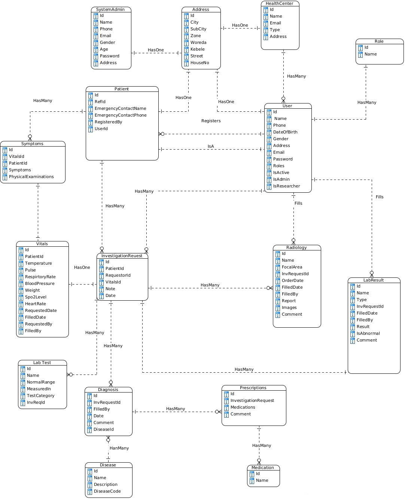
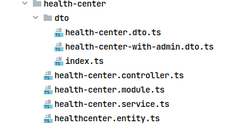

<p align="center" >

</p>

## Table of Contents

- [Introduction](#introduction)
- [Install](#install)
  - [Run with docker](#run-with-docker)
  - [Run Locally](#run-locally)
- [Documentation](#documentation)
  - [Database Structure](#database-structure)
  - [Authentication and Authorization](#authentication-and-authorization)
    - [Authentication](#authentication)
    - [Authorization](#authorization)
- [Module Structure](#module-structure)
  - [Module File](#module-file)
  - [Service](#service)
  - [Controller](#controller)
  - [Entity](#entity)
  - [DTO](#dto)


## [Introduction]()

This repository contains the backend api implementation for an electronic medical record-keeping system that has a
centralized database where all the patients' records are stored. These medical records include
vital information like medical history, allergies, and medication. This system will address the
issues in the current system by allowing doctors access to their patients' records from other
institutions and allowing other institutions to update their patients' records to the database and
also letting patients view their records from several institutions at any time.

The repository for the frontend, built using NextJS can be found <a href="https://github.com/SennayT/EMR-FRONTEND" > here </a>

## [Install]()

Clone the repo and copy the .env.example to .env
```sh
cp .env.example .env
```
### [Run with docker]()

Make sure you have docker installed, then run:


```shell
docker-compose up
```

This will build the backend code and also provision a postgres database.

After starting the server, you can exec into the server container to run migrations and seeds.

To exec to the container run,
```shell
docker-compose exec backend bash
```

After accessing the shell, you can run the migrations using the following command

```shell
yarn typeorm migration:run
```
You can also seed data by running,

```shell
yarn seed
```

You can modify the seed by going into src/seeder/seeder.service.ts

### [Run Locally]()

To run the project locally, first make sure you have Node.js installed. 
The project has been tested on Node.js version 16.x, you can install 
Node.js on POSIX systems using <a href="https://github.com/nvm-sh/nvm" >NVM</a>.

Install Node by running

```shell
nvm install 16
```

You will also need a Postgres server. The project was tested on version 13, but anything above version 12 should work.
After installing a server, copy your credentials to the .env file.

After installing Node.js, install <a href="https://yarnpkg.com/getting-started/install" >Yarn</a> package manager.

Use yarn to install the dependencies by running

```shell
yarn install
```

You can then start the server by running

```shell
yarn start:dev
```

## [Documentation]()

### [Swagger Docs]()

You can find the swagger documentation at <a href="http://localhost:4000" >localhost:4000</a>

### [Database Structure]()

The Entity Relationship (ER) Diagram below shows the organization of the database



### [Authentication and Authorization]()

#### [Authentication]()

The API uses JSON Web Tokens for Authentication.
The secret key for the JWT tokens is stored in the .env file as JWT_SECRET. 
<br/>
The project uses NestJS guards for both Authentication and Authorization. 
<br/>
The following snippet shows how a request can be guarded for authentication.

```ts
  @Post('sample-route') // name of route
  @UseGuards(JwtGuard) // Make sure the user sends a valid JWT token
  guardedRouteExample(@Request() req) {
    return { msg: req.user };
  }
```
In the above snippet, the route is only accessible if the user sends a JWT token. The `@UseGuards` annotation accepts a list of route guards. Here we add `JwtGuard` to protect the route from unauthenticated users.
<br/> <br/>
Route guards can also be placed at the controller level to protect multiple related routes and avoid repetition.

```ts
@UseGuards(JwtGuard)
@Controller('hospital-admin')
export class HospitalAdminController {
    
  //All routes in this file are now protected  
  @Post('sample-route')
  guardedRouteExample(@Request() req) {
    return { msg: req.user };
  }
  
}

```

#### [Authorization]()

Role based Authorization is done in the same manner as Authorization. NestJS provides a `RolesGuard` object and `@Roles` annotation to limit the route users with selected roles.

The following snippet shows a route for Patients only

```ts
@UseGuards(JwtGuard)
@Controller('vitals')
export class VitalsController {
  constructor(private vitalsService: VitalsService) {}

  @Get('/patient')
  @UseGuards(RolesGuard)
  @Roles('Patient')
  getAllForPatient(@Req() req: Request) {
    const user = req.user as User; //The JWT token belongs to a user with a role of Patient
    return this.vitalsService.getAllForPatient(user.id);
  }
}
```
## Module Structure

The project uses the NestJS module organization. Major components are divided into modules and connected with each other using dependency injection.
<br/>
Most modules have a module file, controller file, service file, entity file and a folder called `dto` containing DTO (Data Transfer Object) files.
The image below shows a typical module structure in the project.



### [Module File]()
Modules are the main unit of subdivision in a NestJS project.
The module file contains the data for the module. This includes the services, controllers and other modules that it depends on.
<br/>
The snippet below shows the module file for the Radiology module in the project.

```ts
@Module({
  providers: [RadiologyService], //Providers holds the services in the module
  imports: [ // Imports holds the module's dependencies
    UserModule,
    InvestigationRequestModule,
  ],
  controllers: [RadiologyController], // Controllers holds the controllers in the module
  exports: [RadiologyService], // exports holds the services exposed to other modules
})
class RadiologyModule {}
```

### [Service]()

A service is a class that holds the business logic of a module. The service is used by the controller in the module and other modules.

### [Controller]()

A controller contains the routes in a module. It is responsible for handling requests and sending responses. The business logic is separated to the service file.

### [Entity]()
An entity is a class representation of a table in the database.

### [DTO]()
A DTO (Data Transfer Object) describes the shape of data in an incoming request. 
